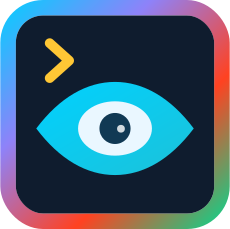

<div style="display: flex; align-items: center; margin-bottom: 2rem;">
  
  <div>
    <h1 style="margin: 0;">Argos</h1>
    <p style="margin: 0.5rem 0 0 0; font-weight: bold;">Type-safe command-line argument parsing library for Kotlin Multiplatform</p>
  </div>
</div>

<div class="grid cards" markdown>

-   :material-rocket-launch-outline: **Easy to Use**

    ---

    Get started with Argos in minutes. Intuitive Argument Parser DSL that feels natural in Kotlin.

    ```kotlin
    val verbose by option("--verbose", "-v").help("Enable verbose output")
    val files by positional("files").list()
    ```

-   :material-shield-check-outline: **Type Safe**

    ---

    Built with Kotlin's type system in mind. Compile-time safety for your CLI arguments.

    ```kotlin
    val count by option("--count").int().default(1)
    val level by option("--level").enum<LogLevel>()
    ```

-   :material-view-module-outline: **Multiplatform**

    ---

    Works on JVM, Native Linux (x64/ARM64), and Windows. One codebase, multiple targets.

    ```kotlin
    // Same code works everywhere
    kotlin {
        jvm()
        linuxX64()
        mingwX64()
    }
    ```

-   :material-cog-outline: **Feature Rich**

    ---

    Subcommands, validation, constraints, help generation, shell completions, and more.

    ```kotlin
    // Conditional requirements and constraints
    val input by option("--input").requireIfAnyPresent(::output)
    val format by option("--format").exactlyOneWith(::raw)  // Group: {format, raw}
    val domains by domain("build").required(::target)
    ```

</div>

## What is Argos?

Argos is a modern command-line argument parsing library designed specifically for Kotlin Multiplatform projects. It provides a type-safe, declarative DSL for defining command-line interfaces while supporting advanced features like subcommands, validation rules, and automatic help generation.

### Key Features

* **🎯 Type Safety**: Leverage Kotlin's type system for compile-time argument validation
* **🚀 Easy DSL**: Intuitive domain-specific language that reads like natural language
* **🔧 Zero Dependencies**: No external runtime dependencies - completely self-contained
* **🌍 Multiplatform**: Native support for JVM, Linux Native (x64/ARM64), and Windows
* **⚡ Performance**: Efficient parsing with minimal memory overhead
* **🎨 Rich Terminal Support**: ANSI colors, plain text, and Markdown output formats
* **🔄 Shell Completions**: Generate completion scripts for Bash, Zsh, and Fish
* **📚 Comprehensive Validation**: Built-in constraints, custom validation, and conditional requirements
* **🎛️ Subcommands**: Full support for git-style subcommand interfaces
* **📝 Automatic Help**: Beautiful, customizable help text generation

## Quick Example

Here's a simple example that demonstrates Argos's key features:

```kotlin
import onl.ycode.argos.Arguments
import onl.ycode.argos.parse

enum class LogLevel { DEBUG, INFO, WARN, ERROR }

class MyApp : Arguments(
    appName = "myapp",
    appDescription = "A sample application built with Argos"
) {
    // Basic options with type conversion
    val verbose by option("--verbose", "-v").bool().default(false)
        .help("Enable verbose logging")
    val level by option("--level", "-l").enum<LogLevel>().default(LogLevel.INFO)
    val count by option("--count", "-c").int().default(1)
        .validate("Count must be at least 1") { it >= 1 }

    // Positional arguments (list must be last)
    val outputFile by positional()
    val inputFiles by positional().list()

    // Conditional requirements
    val backup by option("--backup").requireIfAnyPresent(::outputFile)

    // Built-in help
    val help by help()
}

fun main(args: Array<String>) {
    val app = MyApp()

    app.parse(args,
        onSuccess = {
            println("Verbose: ${app.verbose}")
            println("Level: ${app.level}")
            println("Count: ${app.count}")
            println("Input files: ${app.inputFiles}")
            println("Output file: ${app.outputFile}")
        },
        onError = { error, _ ->
            println("Error: ${error.message}")
            kotlin.system.exitProcess(1)
        }
    )
}
```

Running this application:

```bash
# Show help
./myapp --help

# Basic usage
./myapp --verbose --level DEBUG --count 3 input1.txt input2.txt output.txt

# Short options
./myapp -v -l ERROR -c 5 *.txt result.txt
```

## Why Choose Argos?

### Compared to Other Libraries

| Feature | Argos | Other Kotlin Libraries | JVM Libraries |
|---------|-------|----------------------|---------------|
| Multiplatform | ✅ Full support | ❌ JVM only | ❌ JVM only |
| Type Safety | ✅ Compile-time | ⚠️ Runtime | ⚠️ Runtime |
| Zero Dependencies | ✅ Self-contained | ❌ Requires deps | ❌ Requires deps |
| Modern DSL | ✅ Kotlin-first | ⚠️ Java-style | ❌ Java-style |
| Shell Completions | ✅ Built-in | ❌ Manual | ⚠️ Limited |
| Rich Terminal | ✅ ANSI + Markdown | ❌ Basic | ⚠️ Basic |

### Perfect For

- **✅ Kotlin Multiplatform Projects**: First-class multiplatform support
- **✅ Type-Safe CLIs**: Compile-time argument validation
- **✅ Complex Applications**: Advanced validation and subcommands
- **✅ Distribution**: Zero-dependency, single-file deployment
- **✅ Developer Experience**: IntelliJ IDEA integration and auto-completion

## Getting Started

Ready to build your first CLI with Argos? Check out our comprehensive guides:

<div class="grid cards" markdown>

-   [:material-download: **Installation**](getting-started/installation.md)

    ---

    Add Argos to your project with Gradle or Maven

-   [:material-play-speed: **Quick Start**](getting-started/quick-start.md)

    ---

    Build your first CLI application in 5 minutes

-   [:material-book-open-page-variant: **User Guide**](guide/basic-usage.md)

    ---

    Comprehensive documentation with examples

-   [:material-code-tags: **API Reference**](api/arguments.md)

    ---

    Complete API documentation and reference

</div>

## Community and Support

- **🐛 Issues**: [GitHub Issues](https://github.com/teras/argos/issues) for bug reports and feature requests
- **💡 Discussions**: [GitHub Discussions](https://github.com/teras/argos/discussions) for questions and ideas
- **📖 Documentation**: You're reading it! Comprehensive guides and examples
- **🔄 Updates**: Follow releases on [GitHub](https://github.com/teras/argos/releases)

## License

Argos is open source software released under the [Apache License 2.0](https://github.com/teras/argos/blob/main/LICENSE).
